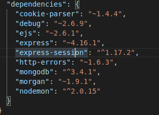

# “开源软件技术”期末项目说明

## 一、项目设计说明书

### 1.项目设计部分：

#### （1）项目总体构成；

本项目的主题主要是我的记事本  ，数据库采用mongodb, 有登录、注册功能，实现登陆拦截，初步实现了新增记事、编辑记事、删除记事、查看记事功能。

通过view视图板块实现功能的展示：

index.ejs  首页                       

login.es  登录                   

regist.ejs注册                                                 

list.ejs内容显示                  

 listAdd.ejs添加界面            

listEdit 编辑界面

通过route实现功能的跳转：

index.js首页跳转   users.js  登录注册跳转  article文章删除、增加、编辑、查看跳转

#### （2）引入的包在项目中的作用相关说明；

cookie-parser(express默认安装):解析二进制和json文件

debug:调试

ejs:渲染

express:  express是一个基于node.js平台的，快速，开放，极简的web开发框架

express-session:处理session,存储登录信息到服务器

http-errors:主要用于处理服务器响应错误

mongodb:连接数据库

morgan:记录日志，express默认的日志中间件

nodemon:开发服务端时,修改完代码需要重新启动才能使代码生效,使用*nodemon*来监听文件变化后自动重启服务

#### （3）项目目录结构和各个部分的说明。

cache:存放一些缓存的数据；

jq、public 放的是bookstrap4框架的一些文件；

model里面是数据库连接入口 ；

node_modules:项目引用的相关包 ；

route路由板块

article.js：定义内容列表、新增内容、删除内容、修改内容的接口，路由实现跳转

index.js：首页跳转路由

users.js：关于登录注册的有关路由，注册接口、登录接口、退出登录接口

view视图板块，其中的文件.ejs为项目页面设计

login.ejs：登录界面

regist.ejs：注册界面

index.ejs：首页界面

list.ejs：我的记录列表界面

listAdd：新增记录界面

listEdit：编辑记录界面

play.ejs为我的喜欢界面

error.ejs  :进行动态页面开发时，后台给前台传参，采用渲染模板error,前台接收参数页面代码

app.js:执行主函数，实现登录拦截和一些跳转规定，还有session的相关操作

### 2.使用说明书

#### （1）登录

设置登陆拦截，进入本系统必须先登录。设置过账号的直接输入用户密码，点击登陆

#### （2）注册

没有设置过账号时，点击注册按钮，通过路由跳转到注册按钮，注册完之后自动跳转到登陆界面

#### （3）首页

登陆成功，进入首页，有  我的记事、新增记事、注销 功能

#### （4）新增记事

点击我的记事，可以获取以往记录

点击新增记事，填写表单并提交，可在我的列表里查看

#### （5）编辑

点击编辑，可以修改

#### （6）删除

点击删除，删除本条记录

#### （7）注销

点击注销，直接退到登录界面

## 二、开发日记

### 1.开发日记（与commit对应）

first:基本上实现了数据库的写入，大致项目的框架

second:完成项目部分优化

second—final：逐渐美化界面

final:上交完整项目